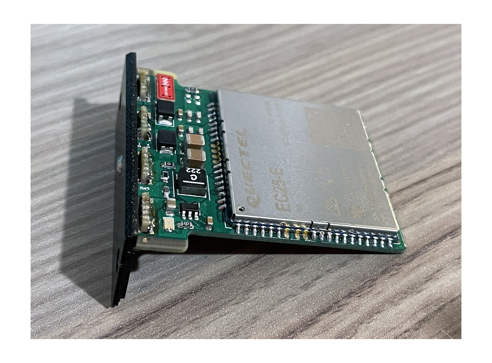

# GPD Pocket 3 Cellular Module

This is a plug-in cellular module for the [GPD Pocket 3](https://gpd.hk/gpdpocket3). It provides LTE Cat. 4 cellular connectivity using a Quectel EC25 (or compatible) module.

It's still a little bit of a prototype at this stage, but initial results are promising!

You can read more about it [on my blog](https://damow.net/gpd-pocket-3-cellular-module).

## Stackup & BOM

4 layers. JLC JLC04101H-7628 Impedance Controlled FR4.

HTML BOMs can be found in the `bom/` directory.

## Questions?

Open an issue or drop me an email - `me@` my blog domain.